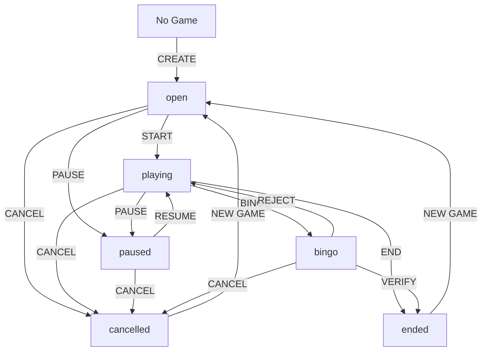

# Buzzword Bingo Backend

This directory contains the backend Lambda functions for the Buzzword Bingo application. The backend is organized into logical modules that handle different aspects of the game system.

## 📁 Directory Structure

```
packages/backend/src/
├── admin/          # Administrative functions for game management
├── auth/           # Authentication and authorization functions  
├── game/           # Core game functionality and player interactions
├── lib/            # Shared utilities, types, and helper functions
└── websocket/      # Real-time WebSocket connection handlers
```

## 🎮 Game State Management System

The Buzzword Bingo application uses a comprehensive state machine to manage game lifecycle:

### Game States

| State | Description | Player Actions | Admin Actions |
|-------|-------------|----------------|---------------|
| **open** | Players can join the game | Join game, view cards | Start, pause, cancel |
| **playing** | Game is active, players can mark words | Mark words, view leaderboard | Pause, end, cancel |
| **paused** | Game temporarily stopped | View cards only | Resume, cancel |
| **bingo** | Someone called BINGO, awaiting verification | View cards only | Verify & end, reject, cancel |
| **ended** | Game completed with winner | View final results | Create new game |
| **cancelled** | Game terminated without completion | View final results | Create new game |

### State Transitions



## 📋 API Endpoints

### Public Endpoints (No Authentication)

| Method | Endpoint | Function | Description |
|--------|----------|----------|-------------|
| POST | `/public/token` | `auth/getPublicToken` | Generate device tokens for status boards |
| GET | `/current-game` | `game/getCurrentGame` | Get current active game information |
| GET | `/games/history` | `game/getGameHistory` | Get historical game data |

### Game Endpoints (Player Session Required)

| Method | Endpoint | Function | Description |
|--------|----------|----------|-------------|
| POST | `/join` | `game/join` | Join a game session |
| GET | `/bingo/{gameId}` | `game/getBingoCard` | Get player's bingo card |
| POST | `/bingo/{gameId}/mark` | `game/markWord` | Mark a word on bingo card |
| GET | `/game/{gameId}/status` | `game/getGameStatus` | Get detailed game status |

### Admin Endpoints (Administrative Access)

| Method | Endpoint | Function | Description |
|--------|----------|----------|-------------|
| POST | `/admin/games/{gameId}/new` | `admin/newGame` | Create a new game |
| POST | `/admin/games/{gameId}/state` | `admin/gameState` | Change game state |
| POST | `/admin/games/{gameId}/reset` | `admin/resetGame` | Reset game data |
| POST | `/admin/system/purge` | `admin/systemPurge` | Clear all system data |
| GET | `/admin/test` | `admin/test` | System health check |

## 🗂️ File Descriptions

### `/admin` - Administrative Functions

- **`gameState.ts`** - Core state management with validation and WebSocket broadcasting
- **`newGame.ts`** - Create new games with word list generation
- **`resetGame.ts`** - Reset game data while preserving structure
- **`systemPurge.ts`** - Complete system data cleanup
- **`test.ts`** - Administrative testing and health checks

### `/auth` - Authentication & Authorization

- **`getPublicToken.ts`** - Generate device-specific tokens for public access

### `/game` - Core Game Functions

- **`joinGame.ts`** - Player registration and game joining
- **`getBingoCard.ts`** - Generate and retrieve player bingo cards
- **`markWord.ts`** - Handle word marking with BINGO detection
- **`getGameStatus.ts`** - Retrieve detailed game information and player status validation
- **`getCurrentGame.ts`** - Find currently active game with player-specific checks
- **`getGameHistory.ts`** - Historical game data and statistics

### `/lib` - Shared Utilities

- **`types.ts`** - TypeScript interfaces and type definitions
- **`handler.ts`** - Lambda function wrapper with error handling
- **`token.ts`** - JWT token creation and validation
- **`gameUtils.ts`** - Shared game logic and utilities
- **`websocketManager.ts`** - WebSocket broadcasting singleton

### `/websocket` - Real-Time Communication

- **`connect.ts`** - Handle new WebSocket connections
- **`disconnect.ts`** - Clean up disconnected clients
- **`message.ts`** - Process incoming WebSocket messages
- **`authorizer.ts`** - Validate WebSocket connection tokens

## 🔄 Data Flow

### Player Game Flow

1. **Join Game**: Player calls `/join` endpoint
2. **Get Card**: Retrieve bingo card via `/bingo/{gameId}`
3. **Mark Words**: Use `/bingo/{gameId}/mark` as words are heard
4. **Real-time Updates**: WebSocket broadcasts leaderboard changes
5. **BINGO Detection**: Backend automatically detects winning patterns

### Admin Game Flow

1. **Create Game**: Use `/admin/games/{gameId}/new` to initialize
2. **State Management**: Control flow via `/admin/games/{gameId}/state`
3. **Monitor**: Check status through `/game/{gameId}/status`
4. **Broadcast**: All state changes trigger WebSocket notifications

## 🏗️ Architecture Patterns

### State Machine Pattern
The game state system implements a formal state machine with:
- **Defined States**: Clear game lifecycle phases
- **Transition Validation**: Prevents invalid state changes
- **History Tracking**: Audit trail of all state changes
- **Event Broadcasting**: Real-time notifications via WebSocket

### Repository Pattern
Data access is centralized through DynamoDB with:
- **Single Table Design**: Efficient NoSQL data modeling
- **Consistent Interfaces**: Standardized CRUD operations
- **Error Handling**: Graceful failure management
- **Performance Optimization**: GSI for efficient queries

### Observer Pattern
Real-time updates use WebSocket broadcasting:
- **Event-Driven**: State changes trigger notifications
- **Scalable**: Handles multiple concurrent connections
- **Reliable**: Automatic connection cleanup and retry logic

## 🔧 Development Guidelines

### Adding New Endpoints

1. Create function in appropriate directory (`admin/`, `game/`, `auth/`)
2. Add route to `infra/api.ts` with proper categorization
3. Update this README with endpoint documentation
4. Add TypeScript interfaces to `lib/types.ts`
5. Include WebSocket broadcasting if needed

### State Management

- Use `admin/gameState.ts` for official state transitions
- Validate transitions through the state machine
- Include reason/audit information for all changes
- Broadcast state changes via WebSocket for real-time updates

### Error Handling

- Use the `handler()` wrapper for consistent error responses
- Include meaningful error messages for debugging
- Log errors with context for monitoring
- Return appropriate HTTP status codes

### Testing

- Use `admin/test.ts` for system health checks
- Test state transitions through the admin API
- Verify WebSocket broadcasting functionality
- Monitor DynamoDB performance and costs

## 📊 Database Schema

### Tables Used

- **Games**: Game configurations and status
- **Players**: Player session information  
- **BingoProgress**: Word marking tracking
- **CompletedBingo**: Winner records
- **Events**: Activity history with TTL
- **BingoCards**: Generated player cards

### Key Design Decisions

- **Single Table Design**: Efficient for NoSQL operations
- **GSI for Queries**: Status-based lookups via Global Secondary Index
- **TTL for Events**: Automatic cleanup of temporary data
- **Denormalized Data**: Optimized for read performance

## 🚀 Deployment

The backend deploys as AWS Lambda functions with:
- **API Gateway**: RESTful HTTP endpoints
- **WebSocket Gateway**: Real-time communication
- **DynamoDB**: Serverless database
- **CloudWatch**: Logging and monitoring

Functions are automatically linked to required resources through SST configuration.

---

*This backend implements a conference-ready buzzword bingo system with enterprise-grade reliability, real-time updates, and comprehensive administrative controls.*
